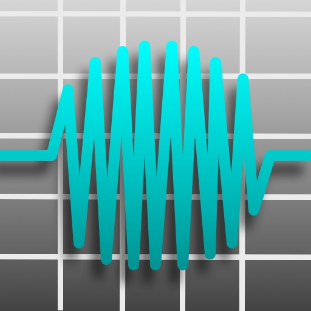

# Introduction

I wrote Datac as an aid for a colleague of mine, Radek Domín of [RallyAnalytics](http://rallyanalytics.com), who was
looking to capture automotive performance data using an Apple iOS device such as an iPhone or iPad (or a suitable
Android device). As I had some experience with iPhone development, I volunteered to help with signal acquisition on the
iOS devices. All of the code for the application was written by me, except where noted below.

The app takes in a signal from the device's mic (internal or headphone jack) and displays it in the main display. It
also takes samples of the data and performs some filtering and detection algorithms in order to determine the vehicle's
current RPM. The data capture component was heavily influenced by Apple sample code that worked with CoreAudio, in
particular custom render procedures for AudioUnit nodes.

Here is a screen capture of the input view. Note that this view is rendered using OpenGL.

Here is a screen capture of the detections view. The plotting here is done via the
[CorePlot](http://code.google.com/p/core-plot/) framework.

You can make a recording of the signal input as an audio file (WAV or CoreAudio format) and these files can then be
transfered to a Mac via iTunes or to a Dropbox folder.

# Dependencies

The RPM plots rely on the [CorePlot](http://code.google.com/p/core-plot/) framework to do all of the heavy lifting. It
is a very nice collection of classes that render wonderful graphs with all of the eye-candy you want. Getting it to
work properly with Datac's tabbed interface took some doing, especially when stressed with orientation rotations, but
it is nonetheless an excellent framework that is only getting better.

For application settings, there is nothing better than the [InAppSettingsKit](http://www.inappsettingskit.com) (IASK)
by Luc Vandal and Ortwin Gentz. Incredibly versatile collection of classes that track and extend how Apple's Settings
application does it work, while giving the programmer the ability to do the setting editing all from within the
application, without having to exit and jump over to the Settings app. Even better, IASK supports different setting
definitions depending on where the editing occurs and on what type of iOS device it is done one.

The integration with [Dropbox](http://dropbox.com/developers) was done in a day using their great SDK package,
available to all for free after registering. I did have to add a way to cancel an active file upload, but everything
else is straight from the SDK. In short, Dropbox is an incredibly easy way to make available data generated on an iOS
device, without having to waiting for an iTunes connection some time in the future.

I created all of the application icons and images using the fantastic [Opacity](http://likethought.com/opacity/)
application. It is not free, but it is worth every bit of its very-reasonable price. I especially like the integration
with Xcode and the automatic generation of icons of varying sizes from the same master. It is an incredible times-aver.

If you find this software useful, I'd appreciate a [note](mailto:bradhowes@mac.com?subject=About%20Datac) saying so.
